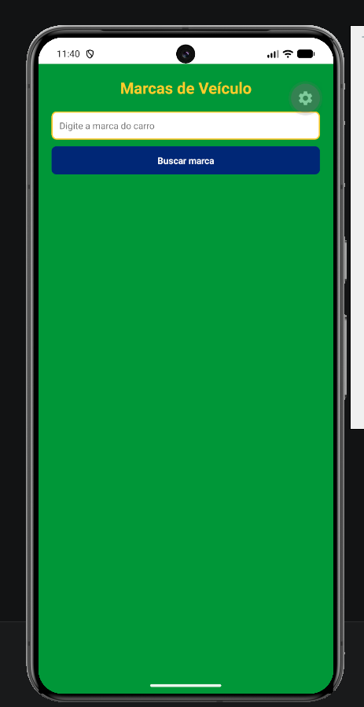
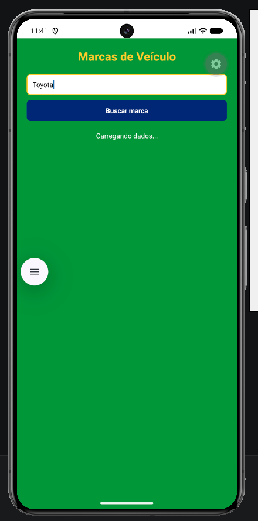
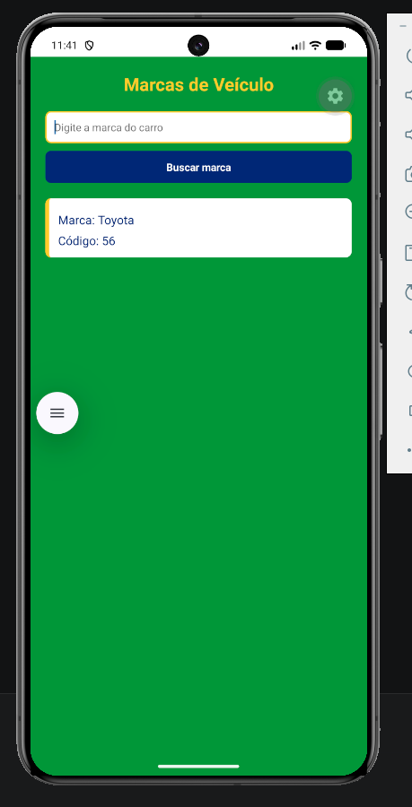
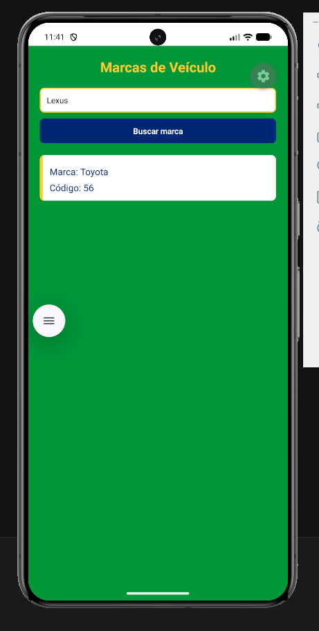
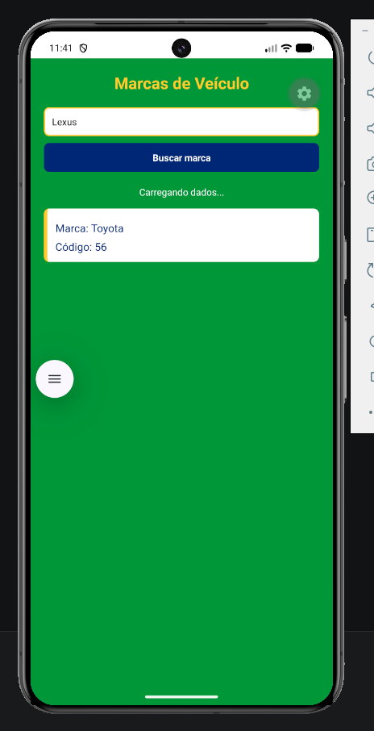
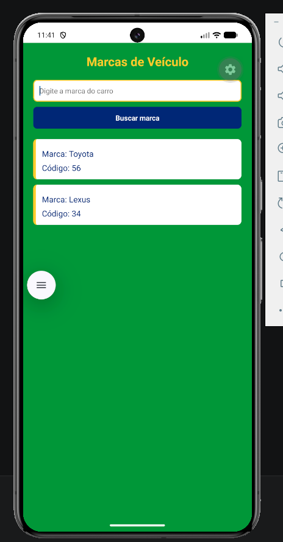

# AtividadeFetchFlatList

O que é o projeto e descrição: Atividade Fetch com FlatList é um projeto desenvolvido para a disciplina de Aplicações Móveis. A aplicação realiza uma requisição HTTP utilizando fetch em uma API pública de marcas de veículos. O usuário pode pesquisar marcas de carros, e os dados retornados são exibidos em uma lista usando o componente FlatList. O projeto também possui loading durante o carregamento dos dados da API.

autor: Arthur Passareli

# Print

Print das telas:

